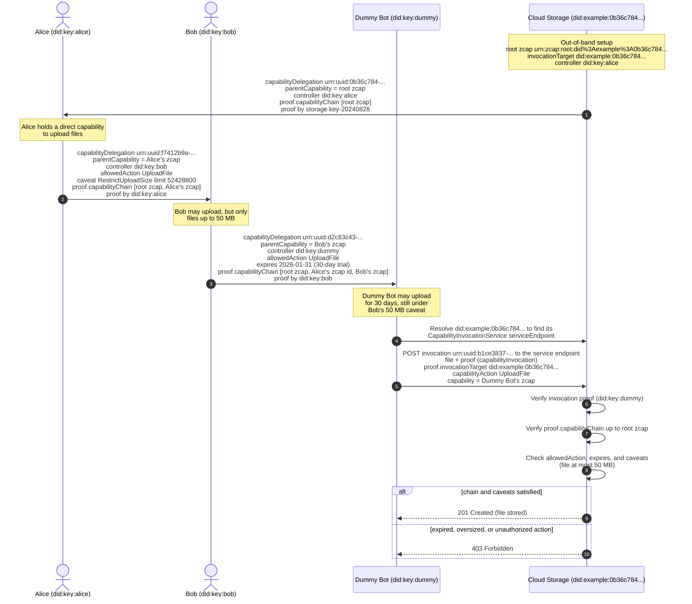
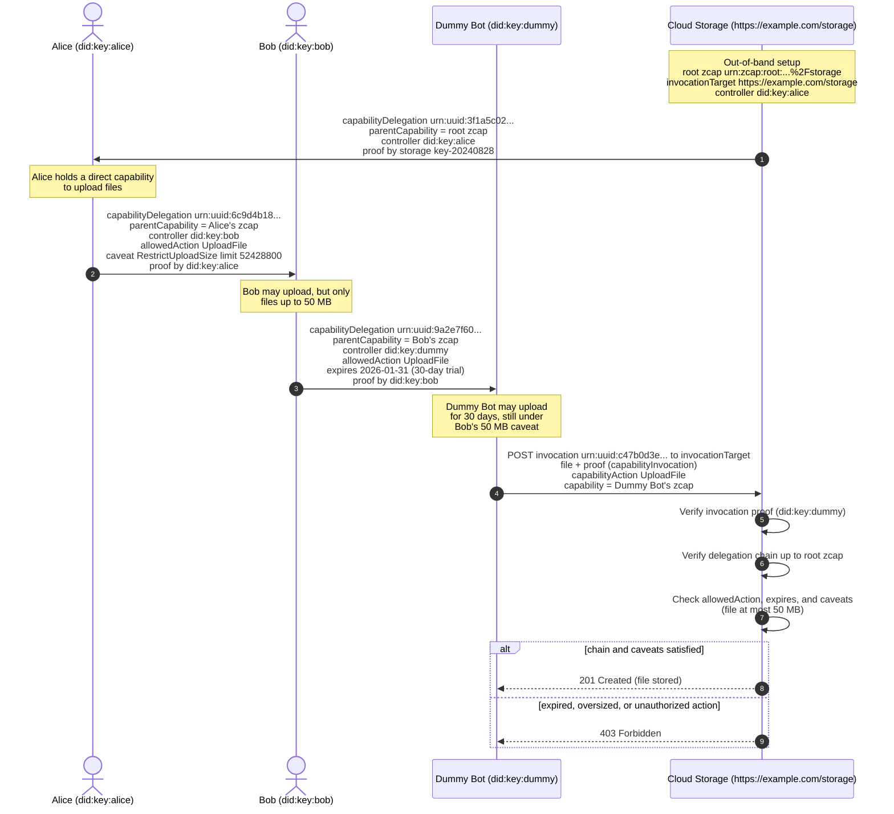

# Use Case: Cloud Storage Delegation

This use case originated in ["Linked Data Capabilities" by Webber, Miller at RWOT5](https://github.com/WebOfTrustInfo/rwot5-boston/blob/master/draft-documents/lds-ocap/lds-ocap.md).

> Alice (A) has a direct capability to store files in a "Cloud Storage"
> system (C).  She would like to share this capability with Bob (B), but she
> is wary of Bob's fondness of storing high-resolution video, so she
> would like to add a constraint that he may only upload files that are
> no larger than 50 megabytes at a time.  Bob is excited to take
> advantage of this service because he has recently been playing with
> Dummy Bot (D), which automatically uploads some photos now and then.
> But Bob has heard mixed reviews of Dummy Bot and is worried that maybe
> Dummy Bot will malfunction.  He has decided that a 30-day window is
> a sufficient trial period for permitting Dummy Bot to upload to the
> storage system, so that he can determine whether to renew at some future
> date.
>
> The initial condition looks like this:
>
> ```
>     .-.       .-.       .-.
>    ( A )---->( B )---->( D )
>     '-'       '-'       '-'
>       \
>        \
>         \
>          \    .-.
>           '->( C )
>               '-'
>```
>
> (A)lice has a capability to the (C)loud storage system through which
> she can upload files.
> (A)lice also has a capability to send a message to (B)ob, and (B)ob
> has a capability to send a message to (D)ummy Bot.

## Cloud Storage Scenario 1: DID `invocationTarget`

This scenario illustrates one way of realizing the Cloud Storage Delegation use case.

In this scenario, the zcap `invocationTarget` is a DID that identifies the Cloud Storage itself,
which is the most faithful to the [original lds-ocap scenario][lds-ocap] where every party, including the Cloud Storage, is identified by a DID.
Because the Cloud Storage is identified by a DID and not by the URL of any particular host,
the capabilities delegated here stay valid even if the Cloud Storage later moves to a different storage location host.
[Cloud Storage Scenario 2](#cloud-storage-scenario-2-http-url-invocationtarget) shows the same use case where the `invocationTarget` is an HTTPS URL.

### Sequence Diagram



### Cloud Storage Setup

The Cloud Storage system needs to be set up in order to provision capabilities that satisfy the use case.

The Cloud Storage system must choose an identifier that identifies the storage system itself.
Here, we'll use the DID `did:example:0b36c784-f9f4-4c1e-b76c-d821a4b32741`, as in the original lds-ocap scenario.
Because this identifier is a DID and not the URL of a storage host, the Cloud Storage is independent of any storage location host.

The Cloud Storage system must support an action that enables uploading a file.
This action must have a unique identifier.
In this example, we'll use the DID URL `did:example:0b36c784-f9f4-4c1e-b76c-d821a4b32741#actions/UploadFile`.
This action must support a caveat that limits the size of files uploaded using the action.
In this example, we'll use `did:example:0b36c784-f9f4-4c1e-b76c-d821a4b32741#caveat/RestrictUploadSize`.
Identifying the action and the caveat relative to the Cloud Storage DID keeps them host-independent too.

Let's assume Alice's actor is identified by `did:key:alice`.
The Cloud Storage system is configured out-of-band to authorize Alice's identifier as a controller.

### Cloud Storage Root Capability

The Cloud Storage will verify capability invocations whose `capabilityChain` is rooted in the cloud storage's root capability `urn:zcap:root:did%3Aexample%3A0b36c784-f9f4-4c1e-b76c-d821a4b32741`.
This root capability identifier is the `urn:zcap:root:` URN whose suffix is the percent-encoded `invocationTarget`, here the Cloud Storage DID.
Because the Cloud Storage `did:example:0b36c784-f9f4-4c1e-b76c-d821a4b32741` has been configured out-of-band to consider Alice's identifier as an authorized controller, the cloud storage's verifier will dereference this root capability identifier to the root capability object
```json
{
	"@context": "https://w3id.org/zcap/v1",
	"id": "urn:zcap:root:did%3Aexample%3A0b36c784-f9f4-4c1e-b76c-d821a4b32741",
	"invocationTarget": "did:example:0b36c784-f9f4-4c1e-b76c-d821a4b32741",
	"controller": "did:key:alice"
}
```

### Cloud Storage Identifier Document

The Cloud Storage identifier `did:example:0b36c784-f9f4-4c1e-b76c-d821a4b32741` resolves to a DID Document or [Controlled Identifier Document][] where
* the `id` is the Cloud Storage DID
* the `capabilityDelegation` property authorizes verification methods that may create capability delegations (e.g. to Alice)
* the `service` property advertises where invocations may be delivered, as a service of type `CapabilityInvocationService`.
  This service type says what the endpoint is for: receiving capability invocations whose `invocationTarget` is this DID.
  A type like `Storage` would describe the storage product rather than the invocation endpoint, and would leave an invoker guessing which of several services accepts invocations.
  The service endpoint may change over time without invalidating any delegated capability, because no capability refers to it.

```json
{
	"@context": "https://www.w3.org/ns/cid/v1",
	"name": "Cloud Storage",
	"id": "did:example:0b36c784-f9f4-4c1e-b76c-d821a4b32741",
	"capabilityDelegation": [
		{
			"id": "did:example:0b36c784-f9f4-4c1e-b76c-d821a4b32741#key-20240828",
			"type": "JsonWebKey",
			"controller": "did:example:0b36c784-f9f4-4c1e-b76c-d821a4b32741",
			"publicKeyJwk": {
				"kid": "key-20240828",
				"kty": "EC",
				"crv": "P-256",
				"alg": "ES256",
				"x": "f83OJ3D2xF1Bg8vub9tLe1gHMzV76e8Tus9uPHvRVEU",
				"y": "x_FEzRu9m36HLN_tue659LNpXW6pCyStikYjKIWI5a0"
			}
		}
	],
	"service": [
		{
			"id": "did:example:0b36c784-f9f4-4c1e-b76c-d821a4b32741#invocations",
			"type": "CapabilityInvocationService",
			"serviceEndpoint": "https://example.com/storage"
		}
	]
}
```

### Alice's Capability

The use case says:

> Alice (A) has a direct capability to store files in a "Cloud Storage"
> system (C).

Alice's capability to store files in the Cloud Storage is represented as a capability delegation where
* `parentCapability` is the URN of the root zcap of the cloud storage invocation target
* `proof` contains a proof of `capabilityDelegation` proven by an authorized verification method from the Cloud Storage identifier document
* `proof.capabilityChain` is the capability ancestors array.
  Because this delegation's parent is the root zcap, the array has exactly one entry: the root zcap identified by ID (never embedded).

```json
{
	"@context": "https://w3id.org/zcap/v1",
	"id": "urn:uuid:0b36c784-4941-4b61-94de-cf5c539041f1",
	"parentCapability": "urn:zcap:root:did%3Aexample%3A0b36c784-f9f4-4c1e-b76c-d821a4b32741",
	"controller": "did:key:alice",
	"expires": "2027-01-01T00:00:00Z",
	"proof": [
		{
			"type": "DataIntegrityProof",
			"cryptosuite": "eddsa-jcs-2022",
			"created": "2026-01-01T00:00:00Z",
			"verificationMethod": "did:example:0b36c784-f9f4-4c1e-b76c-d821a4b32741#key-20240828",
			"proofPurpose": "capabilityDelegation",
			"capabilityChain": [
				"urn:zcap:root:did%3Aexample%3A0b36c784-f9f4-4c1e-b76c-d821a4b32741"
			],
			"proofValue": "zQeVbY4oey5q2M3XKaxup3tmzN4DRFTLVqpLMweBrSxMY2xHX5XTYV8nQApmEcqaqA3Q1gVHMrXFkXJeV6doDwLWx"
		}
	]
}
```

### Alice Delegates to Bob

Alice represents this delegation to Bob as a capability delegation where
* `parentCapability` is the URN of Alice's capability that is being delegated here
* `controller` is a URI controlled by Bob
* `allowedAction` includes the URI of the `UploadFile` method supported by Cloud Storage
* `caveat` includes a caveat supported by the Cloud Storage that limits each UploadFile invocation to 52428800 bytes (50 MB)
* `proof` includes a proof of `capabilityDelegation` proven by the verificationMethod for `did:key:alice`
* `proof.capabilityChain` is the capability ancestors array whose first entry is the root zcap ID and whose last entry is the fully embedded parent capability (Alice's capability)

```json
{
	"@context": "https://w3id.org/zcap/v1",
	"id": "urn:uuid:f7412b9a-854b-47ab-806b-3ac736cc7cda",
	"parentCapability": "urn:uuid:0b36c784-4941-4b61-94de-cf5c539041f1",
	"controller": "did:key:bob",
	"expires": "2027-01-01T00:00:00Z",
	"allowedAction": [
		"did:example:0b36c784-f9f4-4c1e-b76c-d821a4b32741#actions/UploadFile"
	],
	"caveat": [
		{
			"id": "#caveat/RestrictUploadSize-50M",
			"type": "did:example:0b36c784-f9f4-4c1e-b76c-d821a4b32741#caveat/RestrictUploadSize",
			"limit": 52428800
		}
	],
	"proof": [
		{
			"type": "DataIntegrityProof",
			"cryptosuite": "eddsa-jcs-2022",
			"created": "2026-01-01T00:00:00Z",
			"verificationMethod": "did:key:alice#alice",
			"proofPurpose": "capabilityDelegation",
			"capabilityChain": [
				"urn:zcap:root:did%3Aexample%3A0b36c784-f9f4-4c1e-b76c-d821a4b32741",
				{
					"@context": "https://w3id.org/zcap/v1",
					"id": "urn:uuid:0b36c784-4941-4b61-94de-cf5c539041f1",
					"parentCapability": "urn:zcap:root:did%3Aexample%3A0b36c784-f9f4-4c1e-b76c-d821a4b32741",
					"controller": "did:key:alice",
					"expires": "2027-01-01T00:00:00Z",
					"proof": [
						{
							"type": "DataIntegrityProof",
							"cryptosuite": "eddsa-jcs-2022",
							"created": "2026-01-01T00:00:00Z",
							"verificationMethod": "did:example:0b36c784-f9f4-4c1e-b76c-d821a4b32741#key-20240828",
							"proofPurpose": "capabilityDelegation",
							"capabilityChain": [
								"urn:zcap:root:did%3Aexample%3A0b36c784-f9f4-4c1e-b76c-d821a4b32741"
							],
							"proofValue": "zQeVbY4oey5q2M3XKaxup3tmzN4DRFTLVqpLMweBrSxMY2xHX5XTYV8nQApmEcqaqA3Q1gVHMrXFkXJeV6doDwLWx"
						}
					]
				}
			],
			"proofValue": "zQeVbY4oey5q2M3XKaxup3tmzN4DRFTLVqpLMweBrSxMY2xHX5XTYV8nQApmEcqaqA3Q1gVHMrXFkXJeV6doDwLWx"
		}
	]
}
```

### Bob Delegates to Dummy Bot

From the use case:
> But Bob has heard mixed reviews of Dummy Bot and is worried that maybe
> Dummy Bot will malfunction. He has decided that a 30-day window is
> a sufficient trial period for permitting Dummy Bot to upload to the
> storage system, so that he can determine whether to renew at some future
> date.

Bob represents his capability delegation to the Dummy Bot as a capability delegation where:
* `parentCapability` is the URN of Bob's capability that is being delegated here
* `controller` is the URI of the delegee (Dummy Bot's DID)
* `allowedAction` includes the URI of the `UploadFile` method supported by Cloud Storage and invoked by Dummy Bot
* `expires` is explicitly 30 days after the proof `created` date, reflecting Bob's 30-day trial period
* `proof.capabilityChain` is the capability ancestors array. It has three entries:
  the root zcap ID, then Alice's capability referenced by ID only, then Bob's capability (the parent) fully embedded.
  Every ancestor other than the parent is referenced by ID so the delegated zcap stays as small as possible.

```json
{
	"@context": "https://w3id.org/zcap/v1",
	"id": "urn:uuid:d2c83c43-878a-4c01-984f-b2f57932ce5f",
	"parentCapability": "urn:uuid:f7412b9a-854b-47ab-806b-3ac736cc7cda",
	"controller": "did:key:dummy",
	"expires": "2026-01-31T00:00:00Z",
	"allowedAction": [
		"did:example:0b36c784-f9f4-4c1e-b76c-d821a4b32741#actions/UploadFile"
	],
	"proof": [
		{
			"type": "DataIntegrityProof",
			"cryptosuite": "eddsa-jcs-2022",
			"created": "2026-01-01T00:00:00Z",
			"verificationMethod": "did:key:bob#bob",
			"proofPurpose": "capabilityDelegation",
			"capabilityChain": [
				"urn:zcap:root:did%3Aexample%3A0b36c784-f9f4-4c1e-b76c-d821a4b32741",
				"urn:uuid:0b36c784-4941-4b61-94de-cf5c539041f1",
				{
					"@context": "https://w3id.org/zcap/v1",
					"id": "urn:uuid:f7412b9a-854b-47ab-806b-3ac736cc7cda",
					"parentCapability": "urn:uuid:0b36c784-4941-4b61-94de-cf5c539041f1",
					"controller": "did:key:bob",
					"expires": "2027-01-01T00:00:00Z",
					"allowedAction": [
						"did:example:0b36c784-f9f4-4c1e-b76c-d821a4b32741#actions/UploadFile"
					],
					"caveat": [
						{
							"id": "#caveat/RestrictUploadSize-50M",
							"type": "did:example:0b36c784-f9f4-4c1e-b76c-d821a4b32741#caveat/RestrictUploadSize",
							"limit": 52428800
						}
					],
					"proof": [
						{
							"type": "DataIntegrityProof",
							"cryptosuite": "eddsa-jcs-2022",
							"created": "2026-01-01T00:00:00Z",
							"verificationMethod": "did:key:alice#alice",
							"proofPurpose": "capabilityDelegation",
							"capabilityChain": [
								"urn:zcap:root:did%3Aexample%3A0b36c784-f9f4-4c1e-b76c-d821a4b32741",
								{
									"@context": "https://w3id.org/zcap/v1",
									"id": "urn:uuid:0b36c784-4941-4b61-94de-cf5c539041f1",
									"parentCapability": "urn:zcap:root:did%3Aexample%3A0b36c784-f9f4-4c1e-b76c-d821a4b32741",
									"controller": "did:key:alice",
									"expires": "2027-01-01T00:00:00Z",
									"proof": [
										{
											"type": "DataIntegrityProof",
											"cryptosuite": "eddsa-jcs-2022",
											"created": "2026-01-01T00:00:00Z",
											"verificationMethod": "did:example:0b36c784-f9f4-4c1e-b76c-d821a4b32741#key-20240828",
											"proofPurpose": "capabilityDelegation",
											"capabilityChain": [
												"urn:zcap:root:did%3Aexample%3A0b36c784-f9f4-4c1e-b76c-d821a4b32741"
											],
											"proofValue": "zQeVbY4oey5q2M3XKaxup3tmzN4DRFTLVqpLMweBrSxMY2xHX5XTYV8nQApmEcqaqA3Q1gVHMrXFkXJeV6doDwLWx"
										}
									]
								}
							],
							"proofValue": "zQeVbY4oey5q2M3XKaxup3tmzN4DRFTLVqpLMweBrSxMY2xHX5XTYV8nQApmEcqaqA3Q1gVHMrXFkXJeV6doDwLWx"
						}
					]
				}
			],
			"proofValue": "zQeVbY4oey5q2M3XKaxup3tmzN4DRFTLVqpLMweBrSxMY2xHX5XTYV8nQApmEcqaqA3Q1gVHMrXFkXJeV6doDwLWx"
		}
	]
}
```

### Dummy Bot Invokes UploadFile

Dummy Bot is ready to invoke UploadFile on Cloud Storage.

#### Invoking with a JSON Capability Invocation

Here, Dummy Bot will create a JSON Capability Invocation.
In this solution, Dummy Bot creates a JSON Capability Invocation where
* `id` is a unique identifier for this invocation
* `file` is the data in the file.
  Dummy Bot has accessed the documentation for `UploadFile`
  and learned this property is supported by the Cloud Storage service.
* `proof` is a `capabilityInvocation` proof generated by the [`eddsa-jcs-2022` cryptosuite](https://www.w3.org/TR/vc-di-eddsa/#eddsa-jcs-2022).
* `proof.invocationTarget` identifies the resource being invoked, here the Cloud Storage DID
* `proof.capabilityAction` is the identifier of the `UploadFile` method Dummy Bot's capability authorizes in `allowedAction`
* `proof.capability` MUST be the full delegated zcap that is being invoked,
  including that zcap's own `proof.capabilityChain`, so the verifier can verify the whole chain up to the root zcap without dereferencing anything over the network

```json
{
	"id": "urn:uuid:b1ce3837-1f76-4e34-a6ff-eab8278315c5",
	"file": "nEOSQ7jbzBNg0Glup/FfeGDDzvLDvgEL36wcNpmbvKDgPy6+...",
	"proof": {
		"type": "DataIntegrityProof",
		"cryptosuite": "eddsa-jcs-2022",
		"created": "2026-01-01T00:00:00Z",
		"verificationMethod": "did:key:dummy#dummy",
		"proofPurpose": "capabilityInvocation",
		"proofValue": "zQeVbY4oey5q2M3XKaxup3tmzN4DRFTLVqpLMweBrSxMY2xHX5XTYV8nQApmEcqaqA3Q1gVHMrXFkXJeV6doDwLWx",
		"invocationTarget": "did:example:0b36c784-f9f4-4c1e-b76c-d821a4b32741",
		"capabilityAction": "did:example:0b36c784-f9f4-4c1e-b76c-d821a4b32741#actions/UploadFile",
		"capability": {
			"@context": "https://w3id.org/zcap/v1",
			"id": "urn:uuid:d2c83c43-878a-4c01-984f-b2f57932ce5f",
			"parentCapability": "urn:uuid:f7412b9a-854b-47ab-806b-3ac736cc7cda",
			"controller": "did:key:dummy",
			"expires": "2026-01-31T00:00:00Z",
			"allowedAction": [
				"did:example:0b36c784-f9f4-4c1e-b76c-d821a4b32741#actions/UploadFile"
			],
			"proof": [
				{
					"type": "DataIntegrityProof",
					"cryptosuite": "eddsa-jcs-2022",
					"created": "2026-01-01T00:00:00Z",
					"verificationMethod": "did:key:bob#bob",
					"proofPurpose": "capabilityDelegation",
					"capabilityChain": [
						"urn:zcap:root:did%3Aexample%3A0b36c784-f9f4-4c1e-b76c-d821a4b32741",
						"urn:uuid:0b36c784-4941-4b61-94de-cf5c539041f1",
						{
							"@context": "https://w3id.org/zcap/v1",
							"id": "urn:uuid:f7412b9a-854b-47ab-806b-3ac736cc7cda",
							"parentCapability": "urn:uuid:0b36c784-4941-4b61-94de-cf5c539041f1",
							"controller": "did:key:bob",
							"expires": "2027-01-01T00:00:00Z",
							"allowedAction": [
								"did:example:0b36c784-f9f4-4c1e-b76c-d821a4b32741#actions/UploadFile"
							],
							"caveat": [
								{
									"id": "#caveat/RestrictUploadSize-50M",
									"type": "did:example:0b36c784-f9f4-4c1e-b76c-d821a4b32741#caveat/RestrictUploadSize",
									"limit": 52428800
								}
							],
							"proof": [
								{
									"type": "DataIntegrityProof",
									"cryptosuite": "eddsa-jcs-2022",
									"created": "2026-01-01T00:00:00Z",
									"verificationMethod": "did:key:alice#alice",
									"proofPurpose": "capabilityDelegation",
									"capabilityChain": [
										"urn:zcap:root:did%3Aexample%3A0b36c784-f9f4-4c1e-b76c-d821a4b32741",
										{
											"@context": "https://w3id.org/zcap/v1",
											"id": "urn:uuid:0b36c784-4941-4b61-94de-cf5c539041f1",
											"parentCapability": "urn:zcap:root:did%3Aexample%3A0b36c784-f9f4-4c1e-b76c-d821a4b32741",
											"controller": "did:key:alice",
											"expires": "2027-01-01T00:00:00Z",
											"proof": [
												{
													"type": "DataIntegrityProof",
													"cryptosuite": "eddsa-jcs-2022",
													"created": "2026-01-01T00:00:00Z",
													"verificationMethod": "did:example:0b36c784-f9f4-4c1e-b76c-d821a4b32741#key-20240828",
													"proofPurpose": "capabilityDelegation",
													"capabilityChain": [
														"urn:zcap:root:did%3Aexample%3A0b36c784-f9f4-4c1e-b76c-d821a4b32741"
													],
													"proofValue": "zQeVbY4oey5q2M3XKaxup3tmzN4DRFTLVqpLMweBrSxMY2xHX5XTYV8nQApmEcqaqA3Q1gVHMrXFkXJeV6doDwLWx"
												}
											]
										}
									],
									"proofValue": "zQeVbY4oey5q2M3XKaxup3tmzN4DRFTLVqpLMweBrSxMY2xHX5XTYV8nQApmEcqaqA3Q1gVHMrXFkXJeV6doDwLWx"
								}
							]
						}
					],
					"proofValue": "zQeVbY4oey5q2M3XKaxup3tmzN4DRFTLVqpLMweBrSxMY2xHX5XTYV8nQApmEcqaqA3Q1gVHMrXFkXJeV6doDwLWx"
				}
			]
		}
	}
}
```

Dummy Bot delivers this invocation by resolving `did:example:0b36c784-f9f4-4c1e-b76c-d821a4b32741` to the Cloud Storage identifier document above
and POSTing the invocation to the `serviceEndpoint` of its `CapabilityInvocationService`, `https://example.com/storage`.
The `invocationTarget` in the proof remains the DID, not the service endpoint URL, so the invocation remains bound to the Cloud Storage itself rather than to whichever host currently serves it.

<div class="issue">

Open questions for this scenario:
* Can invocation HTTP requests for `invocationTarget` URI A be delivered to a service endpoint URL B, as done here?
* `CapabilityInvocationService` is not currently a registered service type. Should zcap-spec define and register it, so invokers can discover where to deliver invocations for a DID `invocationTarget` interoperably?
* Note the name collision risk between the `CapabilityInvocationService` service type and the `capabilityInvocation` verification relationship. They are unrelated: one says where to send invocations, the other says which keys may make them.
* Can `invocationTarget` be a DID like this?
* Can `invocationTarget` be a DID URL like `did:example:0b36c784-f9f4-4c1e-b76c-d821a4b32741/foo/bar`?
* Does the Cloud Storage identifier document need a `capabilityInvocation` verification relationship?

</div>

## Cloud Storage Scenario 2: HTTP URL `invocationTarget`

This scenario illustrates one way of realizing the Cloud Storage Delegation use case.

In this scenario, the zcap `invocationTarget` is the HTTPS URL of the Cloud Storage.
This is closer to the examples in the latest zcap-spec, whose `invocationTarget` values are HTTP URLs.
Compared to [Cloud Storage Scenario 1](#cloud-storage-scenario-1-did-invocationtarget), the Cloud Storage here is bound to a particular storage location host.

### Sequence Diagram



### Cloud Storage Setup

The Cloud Storage system needs to be set up in order to provision capabilities that satisfy the use case.

The Cloud Storage system must choose an identifier that identifies the storage system itself.
Here, we'll use `https://example.com/storage` as the storage system identifier.

The Cloud Storage system must support an action that enables uploading a file.
This action must have a unique identifier.
In this example, we'll use `https://example.com/storage/method/UploadFile`.
This action must support a caveat that limits the size of files uploaded using the action.
In this example, we'll use `https://example.com/storage/caveat/RestrictUploadSize`.

Let's assume Alice's actor is identified by `did:key:alice`.
The Cloud Storage system is configured out-of-band to authorize Alice's identifier as a controller.

### Cloud Storage Root Capability

The Cloud Storage will verify capability invocations whose `capabilityChain` is rooted in the cloud storage's root capability `urn:zcap:root:https%3A%2F%2Fexample.com%2Fstorage`.
Because the Cloud Storage `https://example.com/storage` has been configured out-of-band to consider Alice's identifier as an authorized controller, the cloud storage's verifier will dereference this root capability identifier to the root capability object
```json
{
	"@context": "https://w3id.org/zcap/v1",
	"id": "urn:zcap:root:https%3A%2F%2Fexample.com%2Fstorage",
	"invocationTarget": "https://example.com/storage",
	"controller": "did:key:alice"
}	
```

#### Note: Root Capability with DID `invocationTarget`

In the [original lds-ocap scenario][lds-ocap], the Cloud Storage is identified by a DID `did:example:3f1a5c02-f9f4-4c1e-b76c-d821a4b32741`.
[Cloud Storage Scenario 1](#cloud-storage-scenario-1-did-invocationtarget) shows how the root capability and the rest of the chain look in that case.

### Cloud Storage Identifier Document

The Cloud Storage identifier `https://example.com/storage` resolves
to a [Controlled Identifier Document][] where
* the `id` is the same HTTPS URL that is the `invocationTarget`
	* when the `id` is an HTTPS URL, the Cloud Storage is bound to the host that serves that URL.
	  See [Cloud Storage Scenario 1](#cloud-storage-scenario-1-did-invocationtarget) for the variation where the `id` is a DID and the Cloud Storage is independent of any storage location host.
* the `capabilityDelegation` property authorizes verification methods that may create capability delegations (e.g. to Alice)

```json
{
	"@context": "https://www.w3.org/ns/cid/v1",
	"name": "Cloud Storage",
	"id": "https://example.com/storage",
	"capabilityDelegation": [
		{
			"id": "https://example.com/storage#key-20240828",
			"type": "JsonWebKey",
			"controller": "https://example.com/storage",
			"publicKeyJwk": {
				"kid": "key-20240828",
				"kty": "EC",
				"crv": "P-256",
				"alg": "ES256",
				"x": "f83OJ3D2xF1Bg8vub9tLe1gHMzV76e8Tus9uPHvRVEU",
				"y": "x_FEzRu9m36HLN_tue659LNpXW6pCyStikYjKIWI5a0"
			}
		}
	],
	"capabilityInvocation": []
}
```

Questions
* Does this need a `capabilityInvocation` verification relationship? Eventually Dummy Bot invokes signing with its key + a capabilityChain delegating authority to it. Is it additionally required that the 

### Alice's Capability

The use case says:

> Alice (A) has a direct capability to store files in a "Cloud Storage"
> system (C).

Alice's capability to store files in the Cloud Storage is represented as a capability delegation where
* `parentCapability` is the URN of the root zcap of the cloud storage invocation target
* `proof` contains a proof of `capabilityDelegation` proven by an authorized verification method from the Cloud Storage identifier document.
* `proof.capabilityChain` is the capability ancestors array.
  Because this delegation's parent is the root zcap, the array has exactly one entry: the root zcap identified by ID (never embedded).

```json
{
	"@context": "https://w3id.org/zcap/v1",
	"id": "urn:uuid:3f1a5c02-9b34-4a7e-8f21-6d0c7b5e4a11",
	"parentCapability": "urn:zcap:root:https%3A%2F%2Fexample.com%2Fstorage",
	"controller": "did:key:alice",
	"expires": "2027-01-01T00:00:00Z",
	"proof": [
		{
			"type": "DataIntegrityProof",
			"cryptosuite": "eddsa-jcs-2022",
			"created": "2026-01-01T00:00:00Z",
			"verificationMethod": "https://example.com/storage#key-20240828",
			"proofPurpose": "capabilityDelegation",
			"capabilityChain": [
				"urn:zcap:root:https%3A%2F%2Fexample.com%2Fstorage"
			],
			"proofValue": "zQeVbY4oey5q2M3XKaxup3tmzN4DRFTLVqpLMweBrSxMY2xHX5XTYV8nQApmEcqaqA3Q1gVHMrXFkXJeV6doDwLWx"
		}
	]
}
```

### Alice Delegates to Bob

Alice represents this delegation to Bob as a capability delegation where
* `parentCapability` is the URN of Alice's capability that is being delegated here
* `controller` is a URI controlled by Bob
* `allowedAction` includes the URI of the `UploadFile` method supported by Cloud Storage
* `caveat` includes a caveat supported by the Cloud Storage that limits each UploadFile invocation to 52428800 bytes (50 MB)
* `proof` includes a proof of `capabilityDelegation` proven by the verificationMethod for `did:key:alice`
* `proof.capabilityChain` is the capability ancestors array whose first entry is the root zcap ID and whose last entry is the fully embedded parent capability (Alice's capability)

```json
{
	"@context": "https://w3id.org/zcap/v1",
	"id": "urn:uuid:6c9d4b18-2e57-4c3a-9a86-1f0e2d7c8b34",
	"parentCapability": "urn:uuid:3f1a5c02-9b34-4a7e-8f21-6d0c7b5e4a11",
	"controller": "did:key:bob",
	"expires": "2027-01-01T00:00:00Z",
	"allowedAction": [
		"https://example.com/storage/method/UploadFile"
	],
	"caveat": [
		{
			"id": "#caveat/RestrictUploadSize-50M",
			"type": "https://example.com/storage/caveat/RestrictUploadSize",
			"limit": 52428800
		}
	],
	"proof": [
		{
			"type": "DataIntegrityProof",
			"cryptosuite": "eddsa-jcs-2022",
			"created": "2026-01-01T00:00:00Z",
			"verificationMethod": "did:key:alice#alice",
			"proofPurpose": "capabilityDelegation",
			"capabilityChain": [
				"urn:zcap:root:https%3A%2F%2Fexample.com%2Fstorage",
				{
					"@context": "https://w3id.org/zcap/v1",
					"id": "urn:uuid:3f1a5c02-9b34-4a7e-8f21-6d0c7b5e4a11",
					"parentCapability": "urn:zcap:root:https%3A%2F%2Fexample.com%2Fstorage",
					"controller": "did:key:alice",
					"expires": "2027-01-01T00:00:00Z",
					"proof": [
						{
							"type": "DataIntegrityProof",
							"cryptosuite": "eddsa-jcs-2022",
							"created": "2026-01-01T00:00:00Z",
							"verificationMethod": "https://example.com/storage#key-20240828",
							"proofPurpose": "capabilityDelegation",
							"capabilityChain": [
								"urn:zcap:root:https%3A%2F%2Fexample.com%2Fstorage"
							],
							"proofValue": "zQeVbY4oey5q2M3XKaxup3tmzN4DRFTLVqpLMweBrSxMY2xHX5XTYV8nQApmEcqaqA3Q1gVHMrXFkXJeV6doDwLWx"
						}
					]
				}
			],
			"proofValue": "zQeVbY4oey5q2M3XKaxup3tmzN4DRFTLVqpLMweBrSxMY2xHX5XTYV8nQApmEcqaqA3Q1gVHMrXFkXJeV6doDwLWx"
		}
	]
}
```

### Bob Delegates to Dummy Bot

From the use case:
> But Bob has heard mixed reviews of Dummy Bot and is worried that maybe
> Dummy Bot will malfunction. He has decided that a 30-day window is
> a sufficient trial period for permitting Dummy Bot to upload to the
> storage system, so that he can determine whether to renew at some future
> date.

Bob represents his capability delegation to the Dummy Bot as a capability delegation where:
* `parentCapability` is the URN of Bob's capability that is being delegated here
* `controller` is the URI of the delegee (Dummy Bot's DID)
* `allowedAction` includes the URI of the `UploadFile` method supported by Cloud Storage and invoked by Dummy Bot
* `expires` is explicitly 30 days after the proof `created` date, reflecting Bob's 30-day trial period
* `proof.capabilityChain` is the capability ancestors array. It has three entries:
  the root zcap ID, then Alice's capability referenced by ID only, then Bob's capability (the parent) fully embedded.
  Every ancestor other than the parent is referenced by ID so the delegated zcap stays as small as possible.

```json
{
	"@context": "https://w3id.org/zcap/v1",
	"id": "urn:uuid:9a2e7f60-4d18-4b52-8c37-5e6a1b0f2d49",
	"parentCapability": "urn:uuid:6c9d4b18-2e57-4c3a-9a86-1f0e2d7c8b34",
	"controller": "did:key:dummy",
	"expires": "2026-01-31T00:00:00Z",
	"allowedAction": [
		"https://example.com/storage/method/UploadFile"
	],
	"proof": [
		{
			"type": "DataIntegrityProof",
			"cryptosuite": "eddsa-jcs-2022",
			"created": "2026-01-01T00:00:00Z",
			"verificationMethod": "did:key:bob#bob",
			"proofPurpose": "capabilityDelegation",
			"capabilityChain": [
				"urn:zcap:root:https%3A%2F%2Fexample.com%2Fstorage",
				"urn:uuid:3f1a5c02-9b34-4a7e-8f21-6d0c7b5e4a11",
				{
					"@context": "https://w3id.org/zcap/v1",
					"id": "urn:uuid:6c9d4b18-2e57-4c3a-9a86-1f0e2d7c8b34",
					"parentCapability": "urn:uuid:3f1a5c02-9b34-4a7e-8f21-6d0c7b5e4a11",
					"controller": "did:key:bob",
					"expires": "2027-01-01T00:00:00Z",
					"allowedAction": [
						"https://example.com/storage/method/UploadFile"
					],
					"caveat": [
						{
							"id": "#caveat/RestrictUploadSize-50M",
							"type": "https://example.com/storage/caveat/RestrictUploadSize",
							"limit": 52428800
						}
					],
					"proof": [
						{
							"type": "DataIntegrityProof",
							"cryptosuite": "eddsa-jcs-2022",
							"created": "2026-01-01T00:00:00Z",
							"verificationMethod": "did:key:alice#alice",
							"proofPurpose": "capabilityDelegation",
							"capabilityChain": [
								"urn:zcap:root:https%3A%2F%2Fexample.com%2Fstorage",
								{
									"@context": "https://w3id.org/zcap/v1",
									"id": "urn:uuid:3f1a5c02-9b34-4a7e-8f21-6d0c7b5e4a11",
									"parentCapability": "urn:zcap:root:https%3A%2F%2Fexample.com%2Fstorage",
									"controller": "did:key:alice",
									"expires": "2027-01-01T00:00:00Z",
									"proof": [
										{
											"type": "DataIntegrityProof",
											"cryptosuite": "eddsa-jcs-2022",
											"created": "2026-01-01T00:00:00Z",
											"verificationMethod": "https://example.com/storage#key-20240828",
											"proofPurpose": "capabilityDelegation",
											"capabilityChain": [
												"urn:zcap:root:https%3A%2F%2Fexample.com%2Fstorage"
											],
											"proofValue": "zQeVbY4oey5q2M3XKaxup3tmzN4DRFTLVqpLMweBrSxMY2xHX5XTYV8nQApmEcqaqA3Q1gVHMrXFkXJeV6doDwLWx"
										}
									]
								}
							],
							"proofValue": "zQeVbY4oey5q2M3XKaxup3tmzN4DRFTLVqpLMweBrSxMY2xHX5XTYV8nQApmEcqaqA3Q1gVHMrXFkXJeV6doDwLWx"
						}
					]
				}
			],
			"proofValue": "zQeVbY4oey5q2M3XKaxup3tmzN4DRFTLVqpLMweBrSxMY2xHX5XTYV8nQApmEcqaqA3Q1gVHMrXFkXJeV6doDwLWx"
		}
	]
}
```

### Dummy Bot Invokes UploadFile

Dummy Bot is ready to invoke UploadFile on Cloud Storage.

#### Invoking with a JSON Capability Invocation

Here, Dummy Bot will create a JSON Capability Invocation.
In this solution, Dummy Bot creates a JSON Capability Invocation where
* `id` is a unique identifier for this invocation
* `file` is the data in the file.
  Dummy Bot has accessed the documentation for `UploadFile`
  and learned this property is supported by the Cloud Storage service.
* `proof` is a `capabilityInvocation` proof generated by the [`eddsa-jcs-2022` cryptosuite](https://www.w3.org/TR/vc-di-eddsa/#eddsa-jcs-2022).
* `proof.invocationTarget` identifies the resource being invoked
* `proof.capabilityAction` is the identifier of the `UploadFile` method Dummy Bot's capability authorizes in `allowedActions`
* `proof.capability` MUST be the full delegated zcap that is being invoked,
  including that zcap's own `proof.capabilityChain`, so the verifier can verify the whole chain up to the root zcap without dereferencing anything over the network

```json
{
	"id": "urn:uuid:c47b0d3e-8f21-4a95-b6d0-2e5c9f1a7b38",
	"file": "nEOSQ7jbzBNg0Glup/FfeGDDzvLDvgEL36wcNpmbvKDgPy6+...",
	"proof": {
		"type": "DataIntegrityProof",
		"cryptosuite": "eddsa-jcs-2022",
		"created": "2026-01-01T00:00:00Z",
		"verificationMethod": "did:key:dummy#dummy",
		"proofPurpose": "capabilityInvocation",
		"proofValue": "zQeVbY4oey5q2M3XKaxup3tmzN4DRFTLVqpLMweBrSxMY2xHX5XTYV8nQApmEcqaqA3Q1gVHMrXFkXJeV6doDwLWx",
		"invocationTarget": "https://example.com/storage",
		"capabilityAction": "https://example.com/storage/method/UploadFile",
		"capability": {
			"@context": "https://w3id.org/zcap/v1",
			"id": "urn:uuid:9a2e7f60-4d18-4b52-8c37-5e6a1b0f2d49",
			"parentCapability": "urn:uuid:6c9d4b18-2e57-4c3a-9a86-1f0e2d7c8b34",
			"controller": "did:key:dummy",
			"expires": "2026-01-31T00:00:00Z",
			"allowedAction": [
				"https://example.com/storage/method/UploadFile"
			],
			"proof": [
				{
					"type": "DataIntegrityProof",
					"cryptosuite": "eddsa-jcs-2022",
					"created": "2026-01-01T00:00:00Z",
					"verificationMethod": "did:key:bob#bob",
					"proofPurpose": "capabilityDelegation",
					"capabilityChain": [
						"urn:zcap:root:https%3A%2F%2Fexample.com%2Fstorage",
						"urn:uuid:3f1a5c02-9b34-4a7e-8f21-6d0c7b5e4a11",
						{
							"@context": "https://w3id.org/zcap/v1",
							"id": "urn:uuid:6c9d4b18-2e57-4c3a-9a86-1f0e2d7c8b34",
							"parentCapability": "urn:uuid:3f1a5c02-9b34-4a7e-8f21-6d0c7b5e4a11",
							"controller": "did:key:bob",
							"expires": "2027-01-01T00:00:00Z",
							"allowedAction": [
								"https://example.com/storage/method/UploadFile"
							],
							"caveat": [
								{
									"id": "#caveat/RestrictUploadSize-50M",
									"type": "https://example.com/storage/caveat/RestrictUploadSize",
									"limit": 52428800
								}
							],
							"proof": [
								{
									"type": "DataIntegrityProof",
									"cryptosuite": "eddsa-jcs-2022",
									"created": "2026-01-01T00:00:00Z",
									"verificationMethod": "did:key:alice#alice",
									"proofPurpose": "capabilityDelegation",
									"capabilityChain": [
										"urn:zcap:root:https%3A%2F%2Fexample.com%2Fstorage",
										{
											"@context": "https://w3id.org/zcap/v1",
											"id": "urn:uuid:3f1a5c02-9b34-4a7e-8f21-6d0c7b5e4a11",
											"parentCapability": "urn:zcap:root:https%3A%2F%2Fexample.com%2Fstorage",
											"controller": "did:key:alice",
											"expires": "2027-01-01T00:00:00Z",
											"proof": [
												{
													"type": "DataIntegrityProof",
													"cryptosuite": "eddsa-jcs-2022",
													"created": "2026-01-01T00:00:00Z",
													"verificationMethod": "https://example.com/storage#key-20240828",
													"proofPurpose": "capabilityDelegation",
													"capabilityChain": [
														"urn:zcap:root:https%3A%2F%2Fexample.com%2Fstorage"
													],
													"proofValue": "zQeVbY4oey5q2M3XKaxup3tmzN4DRFTLVqpLMweBrSxMY2xHX5XTYV8nQApmEcqaqA3Q1gVHMrXFkXJeV6doDwLWx"
												}
											]
										}
									],
									"proofValue": "zQeVbY4oey5q2M3XKaxup3tmzN4DRFTLVqpLMweBrSxMY2xHX5XTYV8nQApmEcqaqA3Q1gVHMrXFkXJeV6doDwLWx"
								}
							]
						}
					],
					"proofValue": "zQeVbY4oey5q2M3XKaxup3tmzN4DRFTLVqpLMweBrSxMY2xHX5XTYV8nQApmEcqaqA3Q1gVHMrXFkXJeV6doDwLWx"
				}
			]
		}
	}
}
```

<!-- TODO deliver invocation to invocationTarget -->

<div class="issue">

This Candidate Solution is incomplete, and should be completed.

Show:
* Bob delegates to Dummy Bot
* Dummy Bot creates invocation of `UploadFile`
* Dummy Bot delivers invocation to `invocationTarget` at Cloud Storage

</div>

[Controlled Identifier Document]: https://www.w3.org/TR/cid-1.0/
[lds-ocap]: https://github.com/WebOfTrustInfo/rwot5-boston/blob/master/draft-documents/lds-ocap/lds-ocap.md
